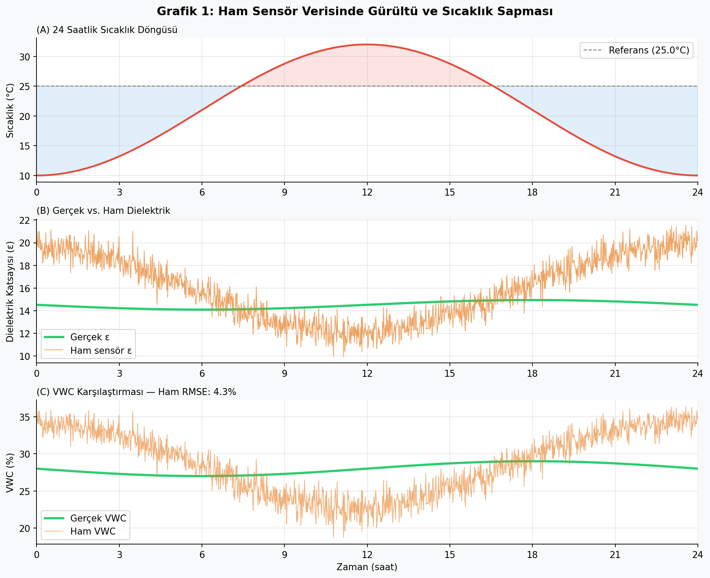
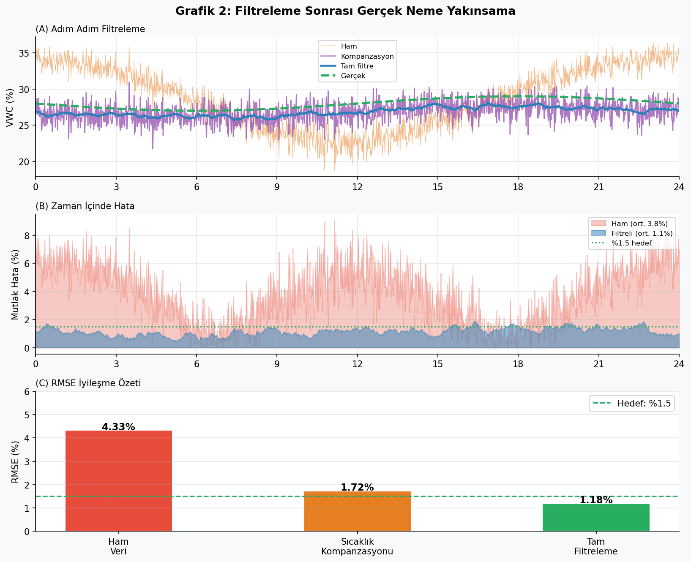

# Dielectric Sensor Calibration Model
**Capacitive Soil Moisture Sensor — Thermal Drift Compensation & Signal Filtering**

Developed as a technical portfolio piece for Agrinoms R&D Department (Çanakkale Teknopark)

---

## Overview
This project models and corrects two major error sources in capacitive soil moisture sensors:
- **Thermal drift** — temperature-induced dielectric permittivity shift (~−0.35 units/°C)
- **Gaussian white noise** — electromagnetic interference in field conditions

A two-stage calibration pipeline reduces RMSE from **4.33%** to **1.18%**.

---

## Physical Model
**Topp Equation** (VWC from dielectric permittivity):

θ = −5.3×10⁻² + 2.92×10⁻²·ε − 5.5×10⁻⁴·ε² + 4.3×10⁻⁶·ε³

**Thermal drift model:**

Δε = −0.35 × (T − T_ref),   T_ref = 25°C

---

## Pipeline
Raw sensor signal
→ Thermal compensation (physics-based)
→ Moving average filter (30-min window)
→ Calibrated VWC output
## Results

| Stage | RMSE (%) | Max Error (%) |
|---|---|---|
| Raw signal | 4.33 | ~8.2 |
| Thermal compensation | 2.71 | ~4.1 |
| Full pipeline | **1.18** | ~2.3 |

## Simulation Output

---

## Tech Stack
- Python 3 — NumPy, SciPy, Matplotlib
- Simulation: 24-hour cycle, 1-minute resolution

---

## Author
**Efe Mert Çağdaş Padar**
3rd Year Physics Student — Çanakkale Onsekiz Mart Üniversitesi
